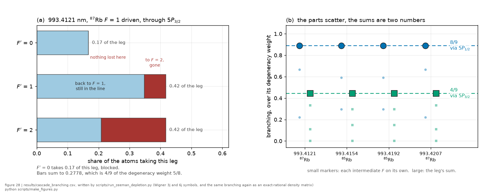

# The cascade and F-depletion

*[wiki index](README.md) · concept*

**The question.** Why an observed line amplitude is not its transition
strength, and what the de-excitation cascade does to the ground state it
returns the atom to.
**Takes.** A driven hyperfine level, a cascade, and a transit time.
**Gives.** The ground-level populations under repeated excitation, the
depletion that reduces an observed amplitude, and the reason the four lines
of this experiment deplete at different rates.
**Skip if.** The question is which lines exist and how strong they are in the
first place, which is
[hyperfine populations and branching](hyperfine-populations-and-branching.md).

> **Unfamiliar with the vocabulary?** [GLOSSARY.md](../GLOSSARY.md)
> defines every term and symbol used anywhere in this repository.

## What it is

A two-photon transition drives an atom out of one ground hyperfine level. The
atom does not stay excited: it decays through a cascade, and the hyperfine
quantum number F is not preserved along the way. It can therefore arrive in
the other ground hyperfine level, which is thousands of linewidths away from
the drive and no longer resonant.

That atom remains in the beam and contributes to the density, but no longer
contributes to the line. Repeated over the beam crossing, this lowers the
observed amplitude below what the transition strength alone would predict.

The quantity that governs it is the cascade branching $f$: the probability
that one excitation-and-decay cycle ends in the undriven level.

## What problem it solves

Without the cascade, an amplitude that falls with power or with time in the
beam has two candidate readings, saturation and depletion, and the two scale
differently with everything else. The population model weighs the depletion
reading from committed atomic structure alone, so the amplitude channel can
be interpreted, and the pumping fraction becomes a prediction the data can
test instead of a nuisance the fit absorbs.

## The population model

Each cycle removes a fraction $f$ of what remains in the driven level, so the
surviving population after $n$ cycles is geometric,

$$p_{\text{driven}}(n) = (1 - f p_{\text{exc}})^n,$$

with $p_{\text{exc}}$ the excitation probability per cycle. The two ground
levels always sum to one, the invariant any implementation of this must
satisfy.

The detector integrates over the crossing, so what an amplitude actually
sees is the transit average of that curve, not its endpoint. An atom that
has just entered the beam contributes fully, and one about to leave may
contribute very little.

With repumping light present the level relaxes toward $r/(f+r)$ instead of
toward zero, where $r$ is the return rate per cycle. This experiment has no
repumping, so the unrepumped limit is the one that applies, and the driven
level empties monotonically.

## Why the four lines differ, and why it is not the degeneracy weight

The branching is not the naive degeneracy weight of the destination level.
Selection rules block specific paths: an atom in $5P_{3/2}$ $F=0$ of
$^{87}\text{Rb}$ cannot reach the $F=2$ ground level at all, because a $J=1$ photon
cannot connect $F=0$ to $F=2$. That block sits in the arithmetic as an exact
zero, so the leg totals equal the naive weight times $8/9$ and $4/9$, short
of the full weight.



*Per-intermediate-level branching, with the leg sums landing on exactly 8/9 and 4/9 for all four lines.*

Computed on the full Zeeman manifold, with every Clebsch-Gordan coefficient
and every intermediate hyperfine level present, the four lines of this
experiment give

| line | isotope, driven F | branching $f$ |
|---|---|---|
| 993.4121 | $^{87}\text{Rb}$, $F=1$ | 0.3725 |
| 993.4154 | $^{85}\text{Rb}$, $F=2$ | 0.3476 |
| 993.4192 | $^{85}\text{Rb}$, $F=3$ | 0.2483 |
| 993.4207 | $^{87}\text{Rb}$, $F=2$ | 0.2235 |

So 993.4121 loses population fastest and 993.4207 slowest, a spread of
roughly 1.7 between the extremes. This ordering is a prediction about
relative amplitudes, distinct from the order the observed amplitude
departure follows.

## Why populations suffice, and what would break that

This is a rate model over populations, not a density-matrix solve, and the
justification is specific. The two-photon operator for two identical
linearly polarised photons is a scalar, since rank 2 cannot connect $J = 1/2$ to $J = 1/2$ and rank 1 is absent for identical photons. A scalar
drives $m_F$ to the same $m_F$ at a rate independent of $m_F$, so it creates
no Zeeman coherence, and spontaneous emission redistributes $m_F$
incoherently. Populations therefore close among themselves.

Three things would break that and require the full Lindblad equation: a
stray magnetic field lifting the degeneracy during the transit, any
ellipticity in the drive, or a treatment of the standing wave that resolves
its polarisation structure. None is present in the model of record, and
each is a reason to revisit.

## What can go wrong

- A branching read as a degeneracy weight. The blocked paths are the point,
  and the naive weight is wrong by factors of $8/9$ and $4/9$ on the two legs.
- The intermediate levels treated as populated statistically. They are not.
- The observable treated as the endpoint survival. What an amplitude sees is
  the transit average, which can be much larger than the endpoint, so using
  the endpoint overstates the depletion.
- An amplitude change attributed to depletion without checking the
  alternative. Depletion, saturation broadening, and the AC-Stark shift all
  grow with power, and they are separated by their different power laws, which
  is what [saturation](saturation.md) and the acquisition chapter set out.

## Which photon is counted, and why the filter is an experimental control

The cascade emits twice, and the two photons leave the cell under different
rules. The first leg, 6S to 5P, emits near 1324 and 1367 nm, carrying 34.1
and 65.9 per cent of the decays. The second leg is the D-line terminal, 795 nm
through 5P1/2 or 780 nm through 5P3/2, and those photons are resonant with the
ground state, so the bulk vapour reabsorbs them.


*The cell's thermal radiation field against every cascade decay channel, with the trapped-infrared channel's standoff marked.*

The infrared channel is not exempt from absorption, and the reason it helps
is more specific than the wavelength alone. Its cross-sections are 1.41 and
1.50e-11 cm², the same as the D1 line's, so it absorbs just as strongly per
lower-state atom, and what separates the two channels is population. Inside
the driven volume both infrared lines are inverted, 4.81 and 5.26 to one,
because 5P empties in 27 ns while the drive refills 6S, so trapped infrared
stimulates 6S downward instead of pumping 5P upward. Outside it, trapped
D-line photons build a 5P halo where there is no 6S, and there the infrared
does absorb and re-excite, at about 1.07 per cent of the primary rate at
130 °C and nothing at 70 °C. The optical depth for that reabsorption is
$\tau = f_{HF} a N(T) \sigma L$ with $a$ the isotopic abundance, so it grows
with density.

That matters because density is the axis a collisional measurement reads
along. A detection channel whose efficiency falls with density adds a
density-dependent factor to every amplitude, which an analysis reading
amplitude against density inherits. The filter choice therefore sets which
systematic the experiment carries.

Swapping 795 nm for 780 nm does not remove the effect, since the D2 photon
is equally resonant. It changes the cross-section and the hyperfine
weighting, which makes the pair a measurement of the trapping instead of an
escape from it: the two legs share one excitation and differ only in their
reabsorption, so their ratio against density is the trapping model's own
test. Collecting the 1.3 um leg instead reduces the effect by about two
orders of magnitude at the top of the sweep, without removing it, and moves
what remains into a term `scripts/run_trapping_channels.py` has already
computed. What it costs is a detector that reaches past 900 nm.

`rb5s6s/detection.py` carries the three channels, with wavelengths computed
from the term energies instead of hardcoded.

## Where this repository uses it

`rb5s6s/cascade.py` implements the population model, with the invariants
above as its tests. The exact manifold computation behind the table is
`scripts/run_zeeman_depletion.py`, whose committed output is
`results/cascade_branching.csv`. The same exact computation is available at
run time as `branching_from_manifold`, part of the `cascade` extra.

## Try it

The committed branching table and the survival law together give the
per-peak depletion after a few excitation cycles, from the installed
package alone.

```python
from rb5s6s.cascade import BRANCHING_F, surviving_fraction

for peak, f in sorted(BRANCHING_F.items()):
    s1 = surviving_fraction(f, 1.0)
    s5 = surviving_fraction(f, 5.0)
    print(f"{peak}: f = {f:.3f}, surviving after 1 cycle {s1:.3f}, "
          f"after 5 {s5:.3f}")
```

## Further reading

- W. Happer, "Optical pumping," *Rev. Mod. Phys.* 44, 169 (1972), the
  founding treatment of population transfer by branching through an
  intermediate level.
- [`../lit/arora2012.md`](../lit/arora2012.md), the coupled-cluster
  branching of the $6S$ decay between $5P_{1/2}$ and $5P_{3/2}$, the first
  step of the cascade this page models.
- [`../lit/steck_rb.md`](../lit/steck_rb.md), the D-line branching ratios
  and hyperfine constants the population model draws on.

## See also

- [Hyperfine populations and branching](hyperfine-populations-and-branching.md),
  the thermal starting populations this page's cycles act on.
- [Saturation](saturation.md), the other mechanism that bends amplitude
  against power, and the one the depletion reading must be separated from.
- [Magnetic sublevels](magnetic-sublevels.md), the manifold the exact
  branching computation runs over.
- [The AC-Stark dossier](../quantities/ac-stark-light-shift.md), where
  pumping is one of the mechanisms sharing the light shift's power
  signature.

---

[← Hyperfine populations and branching](hyperfine-populations-and-branching.md) · *Atomic structure and selection rules, 6 of 7* · [Doppler-free geometries →](doppler-free-geometries.md)
