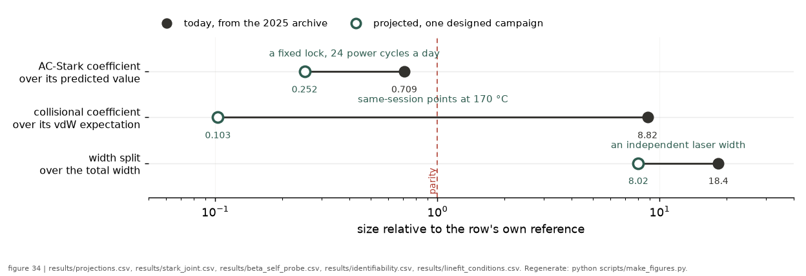

# The digital twin of an experiment

*[wiki index](README.md) · method*

**The question.** How do you find out what an apparatus would measure before
the apparatus exists?
**Takes.** A forward model of the measurement and a fitter that consumes it.
[Monte Carlo methods](monte-carlo-methods.md) supplies the sampling, and
[injection-recovery testing](injection-recovery.md) is the closure test this
builds on.
**Gives.** The achievable uncertainty on each parameter at a proposed design,
which pairs stay degenerate no matter how the design is changed, and the
false-alarm behaviour of the design when there is nothing to find.
**Skip if.** You want to know whether an analysis is correct, which is
[injection recovery](injection-recovery.md). This page is about whether an
experiment is worth building.

> **Unfamiliar with the vocabulary?** [GLOSSARY.md](../GLOSSARY.md)
> defines every term and symbol used anywhere in this repository.

## What it is

A digital twin is the forward model of a measurement, run to generate data
instead of to fit it, then fitted back with the same machinery real data
would meet.

1. State the truth: the line, the widths, the shift coefficient, the
   populations, whatever the physics contains.
2. State the design: power, temperature, span, points across the line,
   repeats, vertical range, sweep order, and the noise the detector
   actually produces.
3. Generate the traces that apparatus would record under that truth.
4. Fit them back with the production fitter, unchanged.
5. Read the achievable uncertainties, the parameter correlations and the
   detection significance, then change the design and repeat.

Steps 1 to 4 are an injection-recovery test. Step 5 makes it a twin: the
object under study stops being the analysis and becomes the experiment.

## What problem it solves

Designing a measurement means choosing among options that all sound
reasonable: more power, a wider span, more repeats, a hotter cell, a
tighter focus. Each is defended with an argument about scaling, and such
arguments are cheap and often wrong. What matters is the uncertainty on a
parameter after a fit with several other free parameters in it, not the
signal-to-noise of a single trace.

A twin replaces the argument with a measurement: doubling the points is
worth whatever the twin says it is worth at this design, and the answer
arrives in minutes.

It also makes a projection falsifiable, as this repository's
[preregistration](preregistration.md) discipline requires. A claim of the
form "this change improves the coefficient by a factor of two" is either
backed by a simulation that produced the two, or it is an unverified
projection.

## The arithmetic that decides whether a twin is even needed

The single most useful thing a twin reports is a correlation, not an
uncertainty, because a correlation says whether more data can help at
all.


*The two-width degeneracy the correlation factor below is computed on:
collisional and laser FWHM, profile likelihood at one measured
condition.*

When two parameters are correlated at $\rho$ in the fit, measuring one
independently and holding it fixed reduces the other's variance to
$(1-\rho^2)$ of its joint value, so its uncertainty falls by
$\sqrt{1-\rho^2}$. That factor depends on $\rho$ alone, not on how many
traces were taken.

If $\rho$ is small, an external constraint adds almost nothing and more
data is the better choice. If $\rho$ is close to one, more data is nearly
worthless for separating the pair, and an external constraint is worth a
large factor. A design study that reports only uncertainties will always
show improvement, since more data always shrinks an error bar, and will
never reveal that the pair stays degenerate.

`rb5s6s.forecast.external_constraint_gain` is that factor, and the
identifiability page carries what it is worth on this experiment's own
degenerate pair.

## What it cannot establish

A twin never validates the physics it was given. It generates data from a
model and fits them with the same model, so agreement shows the code is
internally consistent, not that the model describes nature.

Everything a twin reports is conditional on the forward model, which is
validated against real data elsewhere: by
[injection recovery](injection-recovery.md) on the analysis side, and by
residual structure and [information criteria](information-criteria.md) on
the physics side.

Four further limits, each of which has produced a wrong conclusion
somewhere. A twin cannot see a systematic nobody modelled: the 2025
campaign's vertical-range switching was invisible to any simulation
without a quantiser, and it changed a published analysis. A twin's noise
is as good as its noise law: the tutorial default, independent Gaussian
noise at a constant fraction of the peak, is optimistic, and a forecast
made under it is a lower bound on the uncertainty, not an estimate (see
[the noise law](the-noise-law.md) and
[correlated samples and effective sample size](correlated-samples-and-effective-sample-size.md)).
A twin reports what its fitter can do, not what is possible: a different
estimator might extract more, so the forecast describes the pipeline that
will analyse the data, not an information-theoretic bound. Asked whether
an apparatus can serve some new purpose, a magnetometer say, a twin
computes each channel's response and reports sensitivities, which is
design work, but it cannot make a dataset sensitive to something its
channels never coupled to, since a simulation of the data adds no
information to the data.

## Where this repository uses it

`rb5s6s/forecast.py` is the layer: `synthetic_traces` generates data
under either a constant noise fraction or a measured noise law, with the
laser kernel selectable through `laser_kind` and `gamma_l` so a world can
carry a Gaussian laser component, a Lorentzian one, or both at once, and
`forecast_precision` runs the Monte Carlo over `synthetic_traces` into
`fit_condition`, returning median parameter uncertainties together with
scalings measured by re-running the study at scaled designs, not
asserted from exponents.



*What the 2025 archive bounds today against what one designed campaign is
projected to reach, channel by channel.*

The kernel knobs made the 2026-08-21 identifiability worlds possible,
letting a twin emit a Gaussian or a Lorentzian laser kernel. Five hostile
worlds at 500 trials each measured that the estimator does not
manufacture a Lorentzian laser width from a true zero, a wrong baseline,
or a wrong transit kernel (`results/kernel_worlds.csv`).

`examples/campaign_twin.py` is the worked case: the twin of the next
measurement campaign, carrying the hyperfine amplitudes with cascade
depletion, the saturation companions, the AC-Stark ramp, the blackbody
shift, the measured noise law, and the acquisition design of
[PLAN chapter 7](../plan/07_acquisition-settings.md), including its
single-vertical-range quantisation and a session drift.

The twin also validates a future apparatus, the nanofibre candidate, in
[the guided-atoms page](guided-atoms-and-nanofibres.md) and
[`onf_candidate`](../notes/onf_candidate.md). A reader with no interest
in fibres can skip that thread.

`scripts/run_twin_span_sweep.py` is the twin pointed at a question the
record once answered with unregenerable digits: the span-and-repeats
search, rebuilt from a named committed condition into
[`twin_span_sweep.csv`](../../results/twin_span_sweep.csv). Repeats
reduce the uncertainty as sampling predicts, a factor 3.16 at ten times
the traces, while a five times wider span increases it by a factor 2.72
at fixed points per trace, and the width degeneracy moves by at most
0.0075 under either, the regenerable form of the failed asymmetric-knob
search that [identifiability](identifiability.md) records.

`docs/TUTORIAL.md` walks the loop for a line of the reader's own
choosing, and every code block in it runs as
`examples/tutorial_forecast.py`.

## The redesign: an instrument, a trace kind, and a platform

The twin above answers how well an estimator recovers a known truth. It
now also answers what a named instrument at named settings would
actually store, an acquisition-design question moved into configuration
in `rb5s6s/instruments.py` and `rb5s6s/twin.py`, exercised by
[`twin_realism.csv`](../../results/twin_realism.csv).

Instruments are objects with their own limits, every number read from a
manufacturer manual: record length, effective bit depth per resolution
mode, channel count, and where a manual omits a quantity the field says
so instead of guessing. Asking for a record longer than an instrument
stores raises an error instead of succeeding silently, because a design
that cannot be run should not pass in a twin.

The two resolution mechanisms are distinguished in code, since treating
them alike is how an artefact enters. High resolution is a disjoint
boxcar, leaving neighbouring samples independent. Enhanced resolution is
a constant-phase FIR across stored samples (the operator's manual prints its length and bandwidth per step), correlating neighbours by
construction, which the analysis would later read as physics, and a test
asserts the difference on white noise.

A trace is one peak or all four on a single vertical range. The
four-peak kind carries the measured splittings computed from the peak
wavelengths themselves, so a hand-copied spacing cannot enter, and it
brings its own frequency ruler and brightness comparison.

The platform sets the blackbody term. In the heated cell the atoms sit
inside the radiating body, so the shift is evaluated at the cell
temperature. On the nanofibre they do not: laser-cooled atoms at
microkelvin sit microns from a fibre in a room-temperature laboratory,
and the radiation field is the room's. The twin fixes the fibre platform
at 300 K regardless of atom temperature, carried separately since it
sets only the transit time. Evaluating the shift at the atomic
temperature would return essentially zero, wrong by the whole size of
the term. An invariant test pins both halves.

It does not fit, deliberately. It emits traces in the form
`fit_condition` accepts, so the estimator under test is the production
one.

## What can go wrong

Running only the injected world is one failure: injecting an effect and
detecting it shows the design responds to a signal, not that it stays
quiet with none. Run a null world beside every injected one and report
both, since a design that false-alarms is worse than one that misses.

A second is letting the twin read the committed results: a twin that
loads the repository's own output and agrees with it has proved nothing.
Embed the constants it needs, tag each with its source, and treat the
agreement as a real comparison between two paths to one number.

Third, layers that cannot be switched off: if the cascade depletion, the
saturation companions, and the Stark ramp are welded together, nobody
can find what each contributes, and a wrong layer hides inside a right
total. Every effect should be independently disableable, with the twin
printing what each one moved.

Fourth, a twin that cannot contradict its author. If every layer is
written to confirm the claim being tested, the twin is an expensive
restatement. Each layer should be phrased as a claim with a source, and
the twin should print a verdict per claim, including the ones that
fail.

## Try it

```bash
python examples/tutorial_forecast.py
```

The script defines a line, generates traces from it, fits them back,
degrades the design until the fit fails outright, and forecasts a design
that has not been built, printing a verdict at each stage. Then:

```bash
python examples/campaign_twin.py
```

which runs the same method on a real planned campaign, with an injected
truth and with a null.

## What this repository got wrong, twice

`rb5s6s/cascade.py` shipped with a table assigning which isotope and
which ground hyperfine level each of the four lines drives, and three of
the four assignments were wrong. The twin's own line table, sourced
independently, disagreed with it on contact. A separate, unreleased
tutorial draft claimed that widening the scan span breaks the width
degeneracy. The twin showed otherwise before the page shipped, and the
claim now has a producer, `scripts/run_twin_span_sweep.py`, writing
[`results/twin_span_sweep.csv`](../../results/twin_span_sweep.csv) from a
named committed condition with a fixed seed. The run it replaces reported
$-0.9177$, $-0.9166$ and $-0.881$ for that same correlation, and it
recorded neither its truth parameters nor its seed, so nobody can
regenerate those four decimals. The public surfaces that once quoted them
now quote the producer's rows instead. Both corrections are recorded in
[HISTORY.md](../HISTORY.md).

## Further reading

- Digital twins as a term come from engineering, where a simulation of a
  physical asset is kept synchronised with the asset itself. The usage
  here is the design-stage half of that idea, which the statistics
  literature covers under design of experiments and simulation-based
  power analysis.
- The underlying arithmetic, that conditioning on a correlated parameter
  reduces variance by $(1-\rho^2)$, is the standard partitioned-inverse
  result for a multivariate normal, in any regression text under partial
  correlation.

## See also

- [Injection-recovery testing](injection-recovery.md), the closure test
  this extends.
- [Identifiability](identifiability.md), the quantity a twin is most
  useful for reporting.
- [Monte Carlo methods](monte-carlo-methods.md), the sampling underneath.
- [Designing an acquisition](designing-an-acquisition.md), the settings a
  twin evaluates.
- [Sensitivity analysis](sensitivity-analysis.md), for which input a
  projection depends on.
- [The noise law](the-noise-law.md), without which a forecast is
  optimistic.

---

[← Monte Carlo methods](monte-carlo-methods.md) · *Simulation and computation, 2 of 5* · [Grids and discretisation →](grids-and-discretisation.md)
