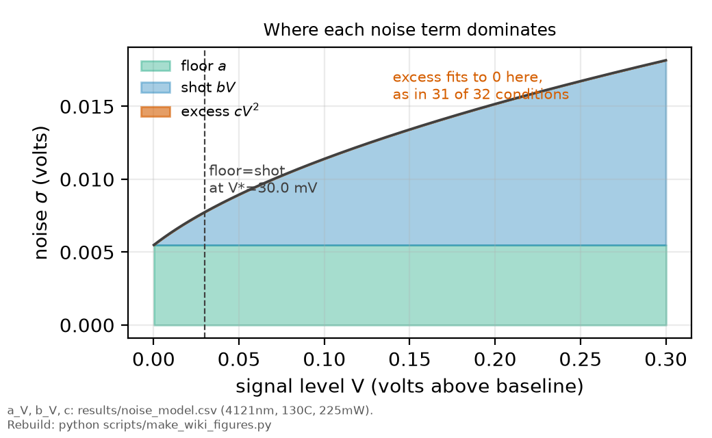

# The noise law

*[wiki index](README.md) · method*

**The question.** How large the uncertainty on each sample is, as a function
of the signal at that sample.
**Takes.** Repeated traces of the same condition. No model of the line.
**Gives.** The variance law that supplies every fit's weights, what its
terms mean physically, and the checks that decide whether a term is real.
**Skip if.** The question is how to use weights once you have them, which is
[weighted least squares](weighted-least-squares.md), or whether adjacent
samples are independent, which is
[correlated samples](correlated-samples-and-effective-sample-size.md).

> **Unfamiliar with the vocabulary?** [GLOSSARY.md](../GLOSSARY.md)
> defines every term and symbol used anywhere in this repository.

## What it is

A detector's noise is rarely constant across a trace. In almost any optical
measurement it grows with the signal, because the dominant contribution is
photon counting statistics. The noise law is the measured relation between
the two, and the standard form is

$$\sigma^2(V) = a^2 + bV + cV^2,$$

with $V$ the signal level above baseline. The three terms are physically
distinct.



*The noise law's three terms plotted against signal level for one committed
condition, showing where each dominates.*

  * $a$ is the **signal-independent floor**: detector dark noise, amplifier
    and Johnson noise, digitiser quantisation, pickup, and any optical
    background that does not scale with the signal.
  * $b$ is the **shot term**, linear in signal because photon arrivals are
    Poisson and the variance of a Poisson count equals its mean. Its
    coefficient is a property of the detection chain: gain and quantum
    efficiency.
  * $c$ is the **excess term**, quadratic in signal, what fractional
    fluctuations produce: laser intensity noise, gain drift, or anything
    that modulates the signal by a fixed proportion.

The floor dominates in the wings and baseline, the shot term over most of a
bright line, and the excess term, if present, at the peak. A measurement
limited by one of them is improved by changes that do nothing for the
others.

## The shot term as gain, the floor as background

The shot coefficient is the gain. For a recorded voltage $V = gN$, $N$
detected quanta and $g$ volts per quantum, Poisson statistics give
$\operatorname{Var}(V) = g^2 \operatorname{Var}(N) = g^2 N = gV$, so $b = g$.
The noise law measures the detection chain's gain without separate
calibration, and dividing a signal level by $b$ gives the number of quanta
behind it.

Any optical background contributes its own counting statistics, with
variance $bV_{\rm bg}$, signal-independent and so folded into $a^2$:

$$\sigma^2 = b (V + V_{\rm bg}), \qquad V_{\rm bg} = a^2/b.$$

The three-parameter law is then one shot process over two pools of quanta,
and $a^2/b$ measures the background level from the variance instead of the
mean, the only route available when a constant background is degenerate
with the fitted baseline. The reading is tested by matching the fractional
noise to one over the square root of the implied count away from the
background. It should hold at every level where the background is
negligible, and departures at the dim end locate the background, not
contradict the law.

A detector with internal multiplication, a photomultiplier or an avalanche
photodiode, adds an excess-noise factor above ideal Poisson from the
multiplication process. That factor multiplies $b$ exactly as a loss of
collection efficiency would, so the law measures their product, not either
alone. Shot-limited means the variance tracks the signal, not that it sits
at the physical bound for photons arriving at the window.

## What problem it solves

Least-squares weights are one over the variance. A wrong noise model does not
only mis-state the error bars, it mis-weights the data and moves the fitted
parameters. The dominant term also names which change would reduce the
noise.

## How it is measured

Take several repeats of one condition, bin the samples by signal level, and
compute the scatter within each bin. That gives $\sigma$ against $V$
directly, with no model of the line, and the law is fitted to those binned
points. Weights follow from the variance of a sample variance over $n$
points going as $2\sigma^4/n$.


*Per-parameter penalty charged by AIC and BIC as a function of sample size,
the model-selection test a noise-law term must pass before it is admitted.*

Including an extra term is a model-selection decision: an unsupported term
inflates the uncertainty on the others, so extra terms are admitted only
when an information criterion prefers them.

One check distinguishes a fitted floor from a measured one: compute the
noise where the signal is absent and compare it with the fitted value, the
same quantity found two ways. A disagreement means the fit is absorbing
something into the floor that does not belong there.

## Where this repository uses it

The law is fitted per condition and supplies the weights for every fit in
the pipeline. Committed values are in
[`results/noise_model.csv`](../../results/noise_model.csv), one row per
condition, with the fitting in the package's noise module.

Three findings from those thirty-two conditions:

  * **The excess term was needed in one condition of thirty-two.** Laser
    amplitude noise and gain drift do not limit this measurement.
  * **The floor and the shot term cross near 8.8 mV**, so above the dimmest
    conditions this is a photon-counting problem.
  * **The floor is not signal-independent here.** It rises with laser power
    on every line, and the direct-wing check confirms that value directly, so
    the floor contains an optical background that scales with the drive.

## What can go wrong

**Fitting the law over too small a range of signal.** The three terms
separate by scaling, so a fit confined to one decade cannot tell them
apart, and the coefficients exchange.

**Assuming the floor is instrumental.** A floor is signal-independent by
construction of the model, not of the apparatus. An optical background
scaling with a control parameter, not the fitted signal, lands in $a$ and
looks electronic.

**Forgetting that the law describes samples.** If adjacent samples are
correlated, the law is still correct per sample, and the independent sample
count is smaller than the total, a separate correction and page.

**Applying one condition's law to another.** Gain, alignment and background
move between conditions, which is why a per-condition fit exists.

## Try it

Where each term dominates, at the committed scales.

```python
import math

a, b, c = 1.5e-3, 1.0e-3, 0.0        # volts, volts, dimensionless
print(f"{'level (V)':>10s} {'sigma (mV)':>11s} {'floor %':>8s} {'shot %':>7s}")
for V in (0.005, 0.02, 0.1, 1.0, 4.0):
    floor, shot = a ** 2, b * V
    tot = floor + shot + c * V ** 2
    print(f"{V:10.3f} {1e3*math.sqrt(tot):11.3f} "
          f"{100*floor/tot:8.1f} {100*shot/tot:7.1f}")
print(f"\nfloor and shot cross at V = a^2/b = {1e3*a*a/b:.2f} mV")
```

Every snippet on these pages is executed by `tests/test_wiki_snippets_run.py`,
so one that stops working fails the suite instead of misleading a reader.

## What the fitted terms say about the apparatus

Across the campaign, the three terms diagnose three different noise sources
([`quantisation.csv`](../../results/quantisation.csv), budget rows). The
floor `a` grows linearly with laser power, 8 to 10 times between 25 and
225 mW, the signature of light-linked background reaching the detector,
consistent with shot noise on a background that grows as the power
squared, with a smaller correlated share that a monitor-photodiode
coherence test would separate. The level term `b` is near-constant across
every condition and peak, cathode shot noise through the multiplier, so
the line peak is photon-limited and only collection helps there. The
quadratic term `c` fits at zero, so
intensity noise on the fluorescence sits below shot noise. The
power-to-zero intercept of `a` is the dark and electronics floor, well under
the light-linked noise at operating power: the transimpedance gain sits in
the right decade, and the digitiser's step, dithered by 5 to 246 times its
size, contributes at most 0.155 per cent.

## Further reading

- P. R. Bevington and D. K. Robinson, *Data Reduction and Error Analysis for
  the Physical Sciences*, 3rd ed. (McGraw-Hill, 2003), for propagating a
  signal-dependent variance into least-squares weights.
- W. Kester, ed., *The Data Conversion Handbook* (Analog Devices, 2005), for
  the instrumental contributions to the floor.

## See also

- [Weighted least squares](weighted-least-squares.md), which consumes this law
- [Correlated samples and effective sample size](correlated-samples-and-effective-sample-size.md),
  a correction the law does not carry
- [Shot noise and technical noise](shot-noise-and-technical-noise.md), for
  telling the terms apart by how they scale with the controls
- [Photon counting](photon-counting.md), for when to abandon the analogue
  chain instead of modelling it

---

[← wiki index](README.md) · *Noise and its management, 1 of 6* · [Shot noise and technical noise →](shot-noise-and-technical-noise.md)
