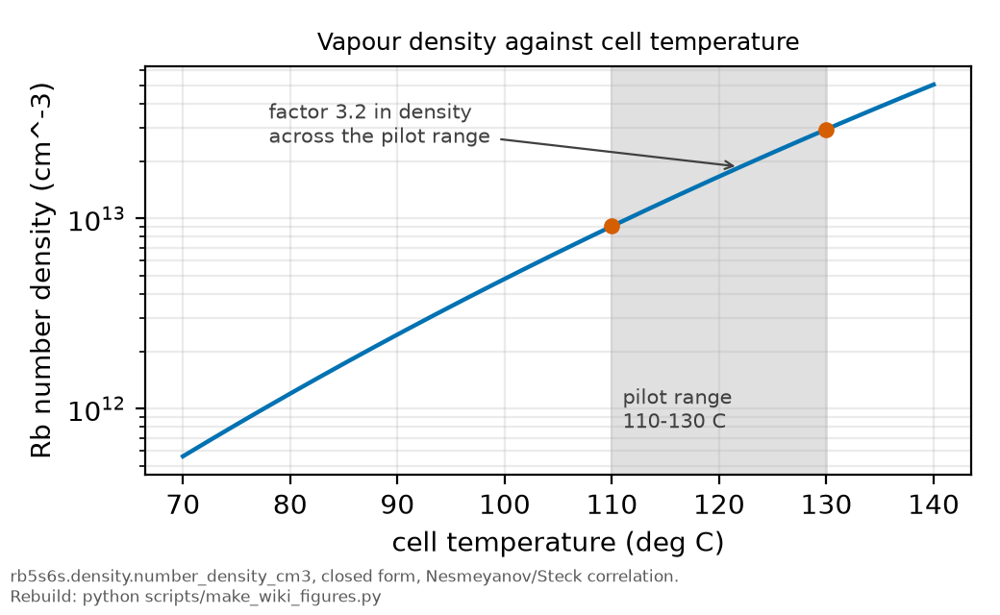

# Vapour density and temperature

*[wiki index](README.md) · concept*

**The question.** How a cell temperature becomes a number density, why a set
point is not a temperature, and its effect on every density-linked
quantity.
**Takes.** A vapour-pressure curve and a cell.
**Gives.** The conversion, its steepness, and the in-situ measurement
replacing an accepted number with a measured one.
**Skip if.** The question is what density does to a lineshape, covered in
[self-broadening](self-broadening.md).

> **Unfamiliar with the vocabulary?** [GLOSSARY.md](../GLOSSARY.md)
> defines every term and symbol used anywhere in this repository.

## What it is

A vapour cell holds liquid or solid metal in equilibrium with its vapour.
The vapour pressure follows an Antoine-type law,

$$\log_{10} p = A - \frac{B}{T},$$

so the number density $n = p / k_B T$ rises steeply with temperature. Near
400 K a ten-kelvin change moves the rubidium density by roughly thirty per
cent. The number easy to read off the apparatus is usually a set point, not
the internal temperature the formula needs.



*Number density against temperature over the pilot's working range, showing
the factor-3.2 span a 20-degree uncertainty produces.*

## What problem it solves

Every collisional quantity in this record is a slope against density.
Density is never measured directly. It is computed through the
vapour-pressure curve from a temperature, so a modest temperature question
becomes a factor-level density question.

## Where this repository uses it

The density conversion enters the self-broadening and trapping channels. The
pedestal thermometer is a campaign lever in
[the acquisition settings chapter](../plan/07_acquisition-settings.md), its
cost and failure conditions in
[the sizing chapter](../plan/06_sizing-and-spending-rules.md).

## A set point is not a temperature

A variac setting, a controller dial and a heater current are all set
points, determined by the oven's own transfer function, which depends on
ambient conditions, thermal contact, and how long the system has run. Two
labels in this archive that read like
temperatures, `91c` and `(90C-0.65A)`, are variac set points, and the
internal temperature they produced is a different number.


*The four thermocouples placed between the vapour cell and its case during
the campaign.*

The 2025-07-17 pilot's internal temperature is carried as a range, 110 to
130 C, because that is what the record supports, a factor of 3.2 in number
density through the vapour-pressure curve. Every quantity that divides by
density inherits it.

A reading can also be a real temperature from the wrong point, or an
average over a cell gradient. Both are treated in what can go wrong, below.

Four thermocouples sat between the vapour cell and its case. The dataset
carries the set point per block, not a logged thermocouple series. Logging
that channel is the fix for the next campaign.

## The in-situ measurement that removes the problem

The Doppler pedestal carries the temperature directly. Atoms moving along
the beam see the two counter-propagating photons shifted in opposite
directions, so the Doppler-free peak sits on a pedestal whose width is the
one-photon Doppler width,

$$\Delta\nu_D = \frac{\nu_0}{c}\sqrt{\frac{8 k_B T \ln 2}{m}},$$

which depends on temperature and nothing else unknown.

The arithmetic is modest: the width goes as $\sqrt{T}$, so a fractional
width error is half the fractional temperature error,

$$\frac{\delta T}{T} = 2 \frac{\delta(\Delta\nu_D)}{\Delta\nu_D}.$$

Resolving 20 K near 400 K needs a width fit good to 2.5 per cent, one wide
slow scan per temperature block.

The pedestal may not separate cleanly from scattered light, and its area
ratio is flat near a retro-reflection ratio of one, so an area-based
estimator loses sensitivity where the geometry is best.

## What can go wrong

- Quoting a set point as a temperature, the most frequent error, covered
  above.
- Using a temperature from the wrong point (oven body or cell wall) or the
  mean of a gradient, instead of the coldest point, which sets the vapour
  density.
- Forgetting that the exponential amplifies error: a five per cent
  temperature error is close to a fifteen per cent density error near
  400 K.
- Treating the density uncertainty as independent between conditions. A
  systematic temperature-scale error moves every condition the same way and
  does not average down across a sweep, understating a fit's true interval.

## Try it

The committed conversion reproduces the same factor: the pilot's 110 to 130
C is a factor 3.2 in density.

```python
from rb5s6s.density import number_density_cm3

for t_c in (110.0, 120.0, 130.0):
    print(f"{t_c:.0f} C: {number_density_cm3(t_c):.3e} cm^-3")

ratio = number_density_cm3(130.0) / number_density_cm3(110.0)
print(f"110 to 130 C moves the density by a factor {ratio:.2f}")
```

## Further reading

- A. N. Nesmeyanov, *Vapor Pressure of the Chemical Elements* (Elsevier,
  1963), source of the rubidium vapour-pressure parameters.
- [`../lit/steck_rb.md`](../lit/steck_rb.md), the vapour-pressure model in
  the form most laboratories quote.

## See also

- [Collisional self-broadening](self-broadening.md), the channel dividing
  by this density.
- [Doppler-free two-photon](doppler-free-two-photon.md), source of the
  pedestal thermometer above.
- [The acquisition settings chapter](../plan/07_acquisition-settings.md),
  where the pedestal thermometer is a campaign lever.

---

[← Collisional self-broadening](self-broadening.md) · *Experimental spectroscopy, 10 of 11* · [Guided atoms and nanofibres →](guided-atoms-and-nanofibres.md)
