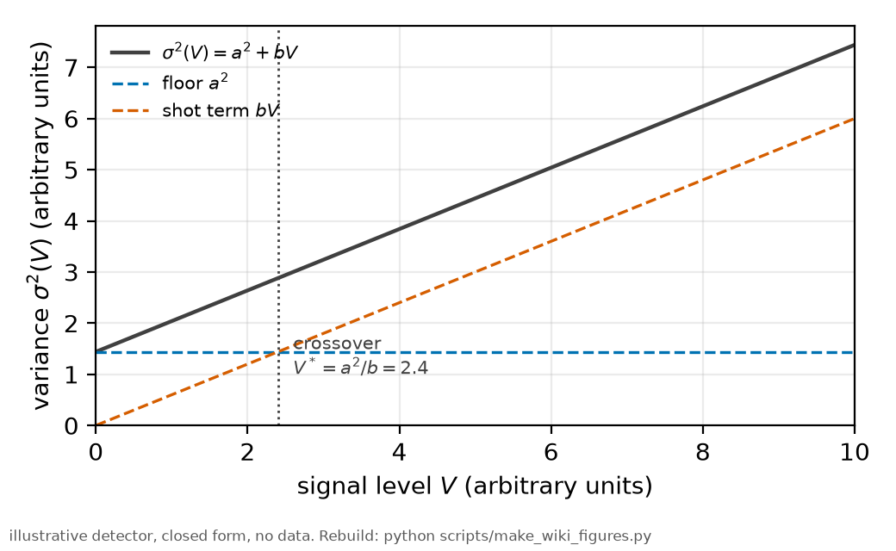
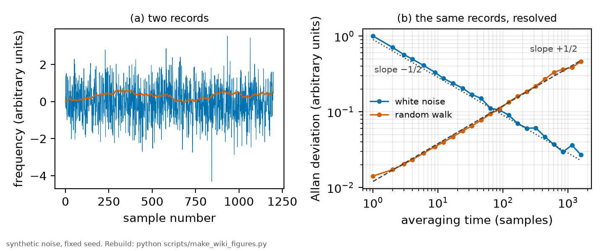

# Weighted least squares

*[wiki index](README.md) · method*

**The question.** How should each measurement be weighted in a fit so that
noisy points do not dominate and the resulting chi-squared means something.
**Takes.** Familiarity with an ordinary least-squares fit and nothing more.
**Gives.** The variance law that gives each point its weight, where the law
comes from, and the correlation-time correction a real detector needs.
**Skip if.** The question is how several repeats of the same measurement get
combined into one estimate, not how one measurement is weighted. That is
[the joint fit](joint-fit.md).

> **Unfamiliar with the vocabulary?** [GLOSSARY.md](../GLOSSARY.md)
> defines every term and symbol used anywhere in this repository.

## What it is

An ordinary least-squares fit minimizes the sum of squared residuals between
a model and a set of measurements, treating every point as equally
trustworthy. That is right only when every point genuinely carries the same
noise. Otherwise an unweighted fit lets the noisiest points pull the model as
hard as the quietest ones, and the fitted parameters come out less precise
than the data allow.



*Measured variance versus signal level: a constant floor below the crossover, shot noise above it.*

Weighted least squares corrects this by minimizing

$$\chi^2 = \sum_i \frac{(d_i - m_i(\theta))^2}{\sigma_i^2}$$

instead, where $\sigma_i$ is point $i$'s own noise: a point known ten times
more precisely counts a hundred times more, since the weight is
$1/\sigma_i^2$. When the $\sigma_i$ used are the true ones, this is the
maximum-likelihood estimator for Gaussian noise, and the resulting $\chi^2$
is a genuine goodness-of-fit statistic, distributed as chi-squared with one
degree of freedom per point minus one per free parameter: a reduced $\chi^2$
near one signals a model and a noise estimate that both describe the data.
Wrong weights lose that signature even when the parameter estimates stay
close, because the reported error bars inherit whatever error the weights
carried.

The weights have to come from somewhere, and two common sources are not
equivalent. The convenient one fits once with equal weights, treats the
residuals as an estimate of each point's noise, and refits with those. This
is circular: the residuals already carry the shape the first fit imposed, so
a systematic mismatch between model and signal, near a peak for instance,
looks like a noisy point and gets downweighted instead of diagnosed. It also
needs more residuals than a single condition usually has: a handful of
repeats give a handful of residuals per point, too few to estimate a
variance with any confidence, so a residual-based weight is often smoothed
or shared across points in a way that assumes the very noise structure it
was meant to measure.

The alternative measures the noise directly from the raw signal, before any
model is asked to explain it. For a detector converting incident photons
into a voltage, the noise has a known form: a constant floor from the
electronics and dark current, independent of how much light arrives, plus a
term that grows with the signal because photon detection is a counting
process and counting noise scales with the count. In variance,

$$\sigma^2(V) = a^2 + bV$$

with $a$ the electronic floor and $b$ the shot-noise coefficient, sometimes
called a Fano term when the counting statistics are not exactly Poissonian.
A further term proportional to $V^2$ can be added for multiplicative noise,
such as source-intensity fluctuations that scale with the signal instead of
its square root, earning its extra parameter only when the data prefer it.

This law pools far more data than any fit's residuals can: the whole trace,
every sample, across every repeat of a condition, not just the points near a
peak, measured once and applied everywhere downstream.

Real detector noise is also not independent sample to sample: thermal drift,
amplifier bandwidth and mechanical vibration all correlate neighboring
samples, so a record of $N$ points carries less information than $N$
independent draws would. The standard measure is an integrated correlation
time $\tau$: the record behaves like an effective sample of roughly
$N_\text{eff}=N/\tau$ independent points, not $N$, and a parameter's
standard error, computed as if the noise were white, has to be inflated by
about $\sqrt{\tau}$ to state the true uncertainty.

The variance law also says where a photon counter beats an analog chain.
Below the signal level where the constant floor $a^2$ equals the
proportional term $bV$, electronics dominate the noise, and a detector that
never carries that floor, one that counts individual detection events
instead of integrating a current, keeps shot-noise-limited performance an
analog chain only reaches near or above the crossover. Above it the two
converge: both are shot-noise limited and the floor is negligible either
way.

## What problem it solves

It turns measurements of unequal quality into a single estimate that neither
lets the noisiest points dominate nor discards the informative ones. It also
turns a converged fit into a genuine statistical statement: a $\chi^2$
evaluated against real, measured weights tests whether the model describes
the data, not just whether the fit produced a set of numbers.

## Where this repository uses it

[`results/noise_model.csv`](../../results/noise_model.csv) holds the fitted
per-condition coefficients, one row per peak, temperature and, for the power
sweep, drive power, with columns `a_V`, `b_V` and `tau_int` among others.
[`rb5s6s/noise.py`](../../rb5s6s/noise.py) produces the file: it bins
second-difference noise samples by local signal level, fits the variance law
above, rescales it against the direct wing noise, and measures $\tau$ from
the autocorrelation of a signal-free wing segment. The method is set out in
[methods chapter 6, section 4.4](../methods/06_the_statistics.md).

Every later fit reads this table instead of estimating its own weights.
[`rb5s6s/linefit.py`](../../rb5s6s/linefit.py) weights the joint lineshape
fit by the noise law and inflates the reported parameter errors by
$\sqrt{\tau_\text{int}}$, and [`rb5s6s/beta.py`](../../rb5s6s/beta.py),
[`rb5s6s/ruler.py`](../../rb5s6s/ruler.py) and
[`rb5s6s/global_fit.py`](../../rb5s6s/global_fit.py) carry the same law and
the same correlation inflation into the ruler and the collisional-slope fits
downstream. [Methods chapter 6, section 4.1](../methods/06_the_statistics.md)
states the principle these modules all implement: fitting is weighted by the
measured noise, never by a fit's own residuals.

The law is specific to the detection chain it was measured on.
[`docs/plan/10_the-fixed-lock-instrument.md`](../plan/10_the-fixed-lock-instrument.md),
section 10c.6, works out where a photon counter would beat the analog chain
the 2025 campaign used, by inverting this law to find the signal level where
its two terms are equal, and states that a new termination, gain or
instrument needs its own noise law measured before any weighted fit
downstream of it can be believed.

## What can go wrong

The clearest failure is weighting by the residuals of a preliminary fit. It
is circular by construction, and worst exactly where a model failure would
show up, at a line's peak, where a systematic mismatch inflates the
residuals and a residual-based weight then discounts them instead of
flagging them.



*Two synthetic noise records, white noise and a random walk. The raw traces alone do not show which one averages away. Only the Allan deviation, separating them by slope, shows why a plain standard deviation cannot stand in for a measured correlation time.*

A second failure is experimental, not statistical: $a$ and $b$ belong to the
detection chain they were measured on and change with the termination, the
gain or the instrument. Reusing an old law after such a change does not just
add scatter: it inflates or deflates weights in a way that varies by signal
level, harder to notice than a uniformly wrong error bar.

A third failure is in the implementation itself. The law's floor is $a$, the
noise at zero signal, and nothing physical can go below it. An earlier
version of [`sigma_of_v`](../../rb5s6s/noise.py) floored the variance at
only a fifth of $a^2$: a condition with a negative curvature term, evaluated
outside its measured level range, could hand out a near-zero variance and a
runaway weight. The floor is now $a^2$ everywhere, the physical bound, not a
tuned number.

Finally, correlated noise: treating $\tau_\text{int}$ as one when the wings
show it is not understates every reported error by roughly
$\sqrt{\tau_\text{int}}$, and a truncated correlation-time estimate is
conservative, not exact, so the size of that understatement is bounded but
not zero.

## Try it

The crossover level, read directly from the coefficients
[`rb5s6s/noise.py`](../../rb5s6s/noise.py) fitted and committed to
[`results/noise_model.csv`](../../results/noise_model.csv): the signal at
which the constant floor and the proportional term contribute equally to the
variance, computed condition by condition, not assumed.

```python
import csv

import numpy as np

with open("results/noise_model.csv", newline="") as f:
    rows = list(csv.DictReader(f))

crossover_mV = np.array(
    [float(r["a_V"]) ** 2 / float(r["b_V"]) * 1000.0 for r in rows])

print(f"{len(rows)} committed conditions in results/noise_model.csv")
print("signal level V* where a^2 (floor) equals b*V (shot term):")
print(f"  median  {np.median(crossover_mV):7.3f} mV")
print(f"  range   {crossover_mV.min():7.3f} to {crossover_mV.max():7.3f} mV")
print("below V*, the electronic floor dominates and a counting detector wins")
```

## When least squares is not enough

Weighting by the true noise law fixes the case where every point's stated
uncertainty is correct and the noise follows a smooth, measured law. It does
not fix a handful of points wrong for a reason the law never modeled: a
stray spark on a detector, a mistimed trigger, a step in a mechanical mount.
A correctly weighted fit still lets such a point pull the answer in
proportion to its stated weight, large precisely because the law expects
that signal level to be quiet.

The standard repair is a family of robust and influence diagnostics: loss
functions that flatten for large residuals instead of squaring them, such as
Huber loss and Tukey's biweight, capping transformations like Winsorization,
and influence measures such as Cook's distance that quantify how much a fit
moves if one point is removed. Case deletion, the bootstrap and the
jackknife ask the same question by resampling instead of reweighting.

None of that belongs in place of a weighted fit. The right use is beside it,
as a diagnostic: fit both ways. Agreement leaves the standard fit more
credible than it was alone. Disagreement names which points to examine
before trusting either answer.

## Values that moved
The collisional-slope parameter $\beta_\text{self}$ carries one entry
relevant to this page. Its interval was once built from between-block
scatter with a hard-coded multiplier, and [HISTORY.md](../HISTORY.md)
records what moved it: the multiplier hid its own assumption about degrees
of freedom. The replacement read the same scatter off the Student-t
quantile for the single residual degree of freedom the data had, and
HISTORY.md labels the change interval construction, not new data.

## Further reading

- P. R. Bevington and D. K. Robinson, *Data Reduction and Error Analysis for
  the Physical Sciences*, 3rd ed. (McGraw-Hill, 2003), the standard physics
  treatment of weighted least squares and $\chi^2$.
- W. H. Press, S. A. Teukolsky, W. T. Vetterling and B. P. Flannery,
  *Numerical Recipes*, 3rd ed. (Cambridge University Press, 2007), chapter
  15, for the algorithms and the general least-squares formulation.
- P. J. Huber, *Robust Statistics* (Wiley, 1981), the origin of the Huber
  loss named above.
- [The joint fit](joint-fit.md), which shares these same weights across
  repeats.
- [Identifiability](identifiability.md), for what a correctly weighted
  covariance still cannot tell apart.

## See also

- [The joint fit](joint-fit.md), for how these weights carry across repeated
  traces of one condition.
- [Identifiability](identifiability.md), for what a correctly weighted fit
  still cannot separate.
- [Robust fitting](robust-fitting.md), for the point a stated weight does not
  cover, wrong for a reason the noise law never modeled.
- [Influence diagnostics](influence-diagnostics.md), for measuring how much a
  single point moves the fitted answer.

---

[← wiki index](README.md) · *Statistical inference, 1 of 9* · [The joint fit →](joint-fit.md)
